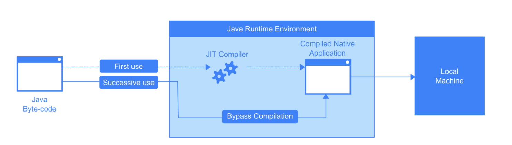
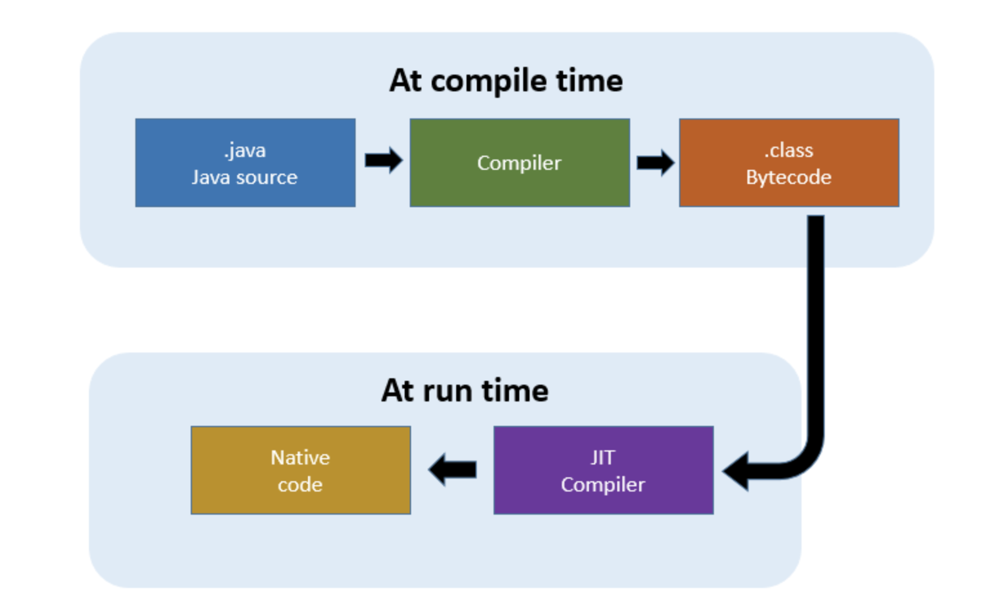

# 목표
## JVM은 무엇이며 자바 코드는 어떻게 실행하는 것인가
- 자바 소스 파일(.java)을 JVM으로 실행하는 과정 이해하기.

## 학습할 것
- [JVM이란 무엇인가](#JVM이란-무엇인가)
- [컴파일 하는 방법](#컴파일-하는-방법)
- [실행하는 방법](#실행하는-방법)
- [바이트코드란 무엇인가](#바이트-코드란-무엇인가)
- [JIT 컴파일러란 무엇이며 어떻게 동작하는지](#JIT-컴파일러란-무엇인가)
- [JVM 구성 요소](#JVM-구성-요소)
- [JDK와 JRE의 차이](#JRE란)

### JVM이란 무엇인가
    JVM이란 Java Virtual Machine 의 줄임말로 write once, run everywhere
    즉, OS마다 따로 코드를 작성해야하는 번거로움 없이 '플랫폼, OS에 독립적'으로 Java 프로그램을 작성하여 실행할 수 있게 해주는 프로그램이다.
    
    이러한 JVM은 어떻게 동작할까?
    
    예를 들어 C 프로그램은 바로 *기계어로 컴파일 되므로 *H/W 에 맞게 각각 컴파일되어야 한다.
        * CPU 제조사에 따라 해석할 수 있는 기계어가 다르기 때문임. -> "플랫폼에 종속적"
        
    그에 반해 Java 프로그램은 CPU가 해석할 수 있는 기계어가 아닌 "JVM이 해석 가능한" 가상 머신용 바이트 코드로 컴파일되고
    JVM이 OS 의존적인 부분을 대신 처리해주기 떄문에 플랫폼에 "독립적"이게 동작할 수 있다. 
        -> JVM은 플랫폼에 종속적
        -> 컴퓨터가 바로 인식할 수 있는 "바이너리 코드"가 아닌 "바이트 코드"로 변환된다.
        
    즉 소스파일(*.java)은 컴파일러(javac)에 의해 중간단계 언어(바이트 코드)로 컴파일되고, 
    JVM이 이러한 컴파일된 자바 클래스 파일(*.class)을 OS에 맞는 기계어로 변환(인터프리터와 JIT 컴파일러)하여 실행하는 것이다.
        - JVM을 위한 바이트 코드를 자바 바이트 코드라고 한다.
        - javac.exe : 자바 컴파일러, 자바로 작성된 소스코드를 바이트코드로 변환한다.
        - java.exe : 자바 인터프리터, 바이트코드를 실행한다.
        
    * 정리 
    1) Java 클래스 파일(.class)을 로드하고
    2) 바이트 코드를 해석하며
    3) 메모리 등의 자원을 할당하고 관리하며 정보를 처리하는 프로그램
    
    ● JVM 스팩: https://docs.oracle.com/javase/specs/jvms/se11/html/
    ● JVM 밴더: 오라클, 아마존, Azul, ...
    

### 바이너리 코드란 무엇인가
    바이너리 코드는 컴퓨터가 인식할 수 있는 0과 1로 구성된 이진코드를 의미한다.
    
### 기계어란?
    기계어는 "CPU가 직접 해독하고 실행할 수 있는" 비트 단위(0과 1로 이루어짐)로 쓰인 컴퓨터 언어이다.
    기계어가 이진코드로 이루어졌을 뿐이지, 모든 이진코드가 기계어인 것은 아니다. ( 바이너리 코드 != 기계어)
    
    * 기계어는 특정한 언어가 아니다. 
       - 단지 CPU제조사에서 CPU를 만들 때 해당 CPU에서 사용하는 명령어 집합을 공개하는데, 이것을 '기계어'라고 부를 뿐이다.
       - 때문에 CPU가 변경되면 기계어가 달라진다. 같은 동작을 하는 명령어지만 완전히 다른 0과 1의 나열이 될 수 있다는 말이다. 
       - 같은 회사의 CPU라도 버전 별로 다른 명령을 포함할 수 있으며 다른 회사라도 같은 명령어 집합을 공유할 수도 있다.
    
### 바이트 코드란 무엇인가
    "CPU"가 이해할 수 있는 언어가 "바이너리 코드"라면, "바이트 코드"는 "가상 머신"이 이해할 수 있는 0과 1로 구성된 이진코드이다.
    즉 고급언어로 작성된 "소스코드"를 가상 머신이 이해할 수 있는 중간 코드로 컴파일 된 어떤 플렛폼에도 종속되지 않게
    실행될 수 있는 "가상 머신용 기계어 코드"이다.
    
    바이트 코드는 다시 실시간 번역기 또는 저스트 인 타임(just-in-time, JIT) 컴파일러에 의해 바이너리 코드로 변환된다.
   
### 컴파일 하는 방법
    컴파일이란 우리의 언어는 컴퓨터가 이해하지 못하므로 컴퓨터가 이해할 수 있도록 "통역"하는 작업을 말한다.
    
    1. 자바 컴파일러는 자바 개발 키트(JDK)에 포함되어 있기 때문에 작성된 코드를 컴파일해 바이트코드를 생성하기 위해선 우선 JDK가 필요하다.
    2. 자바 언어 사양(JLS)을 충족하는 자바 소스코드(*.java) 파일을 작성한다.
    3. 자바 컴파일러(javac.exe)를 통해 자바 소스코드(.java)를 자바 가상 머신 사양(JVMS)을 충족하는 바이트코드(.class)로 컴파일 한다.
        - javac Test.java
    4. *.class 파일이 생성된 것을 확인 할 수 있다.
        - Test.class
    
### 실행하는 방법
    java.exe -> 자바 인터프리터로서 컴파일러로 생성된 바이트 코드를 해석하고 실행한다.
    - java Test
    
### 역컴파일하는 방법
    javap.exe(역어셈블러) -> 컴파일된 클래스 파일을 원래의 자바 소스코드로 변환한다.
    - javap Test

### JIT 컴파일러란 무엇인가
    JIT는 Just-In-Time의 약어로서 그림에서 볼 수 있듯이 JRE안에 존재해서 프로그램을 실제 실행하는 시점에(런타임시)
    해당 플랫폼에 맞는 기계어(native machine code)로 컴파일하는 컴파일 기법이다.

    즉 간단히 말해서 JRE안에 존재하면서 프로그램을 실행할 때 기계어로 번역해 전달하는 장치인 것이다.

### 그렇다면 이러한 JIT는 왜 쓰이고 어떻게 동작할까?
    자바 바이트 코드는 인터프리터 언어(interpreter language)이다. 
    한줄씩 읽고 해석하고, 그에 해당하는 기능을 실행시키는 인터프리터 언어이기에 기기에서 직접 돌아가는 기계어로 컴파일 되는
    C/C++와 같은 언어들로 만든 실행 파일에 비하면 실행 속도가 느리다.
    
    이러한 실행 속도를 개선하기 위해 같은 코드를 매번 새롭게 해석하는 대신 실행하기 전에 JIT 컴파일러를 이용해 같은 코드를 네이티브 코드로 바꿔두고
    그 다음 부터는 컴파일된 코드를 사용해 인터프리터의 느린 실행 성능을 개선할 수 있다.
   
    즉 인터프리터 효율을 높이기 위해, 바이트 코드를 원시 코드로 컴파일 할 때(런타임 떄) Java 애플리케이션의
    실행 속도의 성능 향상을 가져오는 Java Runtime Environment의 구성 요소인 것이다.
    
    단점이라면 초기 구동 후에 얼마간은 바이트코드를 컴파일하는데에 시간과 메모리를 소모하기 때문에 정적 컴파일된 프로그램에 비해
    초기 실행 속도와 메모리 사용량에서 손해를 보는 단점도 있다.
    특히 실행 시간이 매우 짧은 경우에는 애써 컴파일된 코드를 제대로 사용하기도 전에 프로그램이 끝나느 배보다 배꼽이 더 큰 상황이 벌어지기도 한다.

### JVM 구성 요소

### JRE란
    JRE(Java Runtime Enviroment)란 컴파일된 자바 프로그램을 실행시킬 수 있는 자바 실행 환경으로
    JVM과 JVM이 자바 프로그램을 동작시킬 때 필요한 라이브러리 파일 및 자바 런타임 환경에서 사용하는 프로퍼티 세팅이나 리소스 파일을 가지고 있다.
    JRE는 *.class 파일을 JVM으로 로딩시키는 역할을 하고, JVM은 *.class 파일을 해석해 실행할 수 있는 상태로 만든다.
    
    즉 JRE는 JVM의 실행환경을 구현했다고 할 수 있다.
    

### JDK란
    JDK(Java Development kit)란 자바 애플리케이션 개발 환경으로 JRE(자바 실행 환경)뿐만 아니라
    소스 파일의 컴파일러 및 디버거 등 자바 애플리케이션을 개발하기 위한 도구(javac, java등)가 포함되어 있다.
    
    즉 JDK를 설치하면 JRE도 같이 설치가 되기 떄문에, JDK = JRE + @ 라고 생각하면 된다.
    

