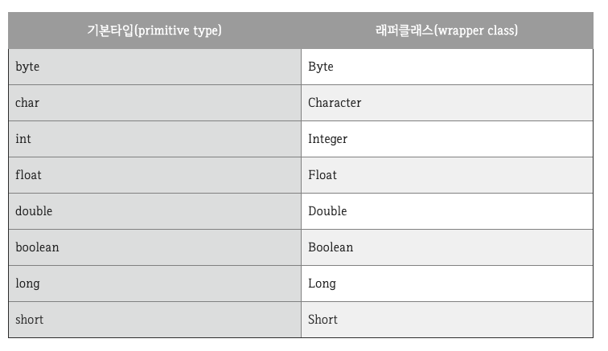
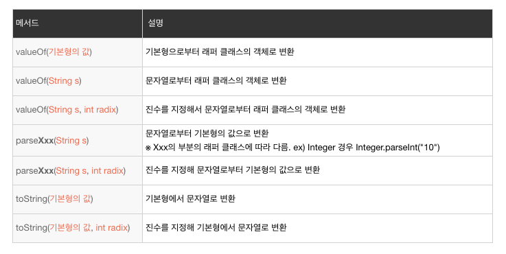
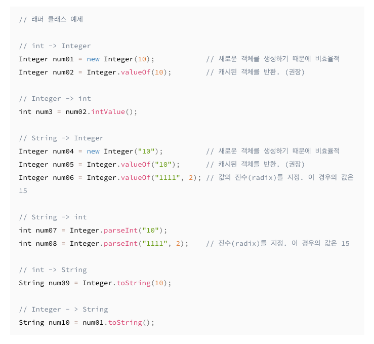

# 목표
## 자바 데이터 타입, 변수 그리고 배열
- 자바의 프리미티브 타입, 변수 그리고 배열을 사용하는 방법을 익힙니다.

## 학습할 것
- [프리미티브 타입 종류와 값의 범위 그리고 기본 값](#프리미티브-타입-종류와-값의-범위-그리고-기본-값)
- [프리미티브 타입과 레퍼런스 타입](#프리미티브-타입과-레퍼런스-타입)
- [래퍼 클래스](#래퍼-클래스)
- [리터럴](#리터럴)
- [변수 선언 및 초기화하는 방법](#변수-선언-및-초기화하는-방법)
- [변수의 스코프와 라이프타임](#변수의-스코프와-라이프타임)
- [타입 변환, 캐스팅 그리고 타입 프로모션](#타입-변환,-캐스팅-그리고-타입-프로모션)
- [1차 및 2차 배열 선언하기](#1차-및-2차-배열-선언하기)
- [타입 추론, var](#타입-추론-var)

### 프리미티브 타입 종류와 값의 범위 그리고 기본 값
*메모리 공간에 데이터(값)가 저장된다.*

    "정적 타입 언어"인 자바는 변수의 선언 시에 타입을 명기하여 컴파일할 때 타입의 정합성을 체크한다. 
    이러한 자바의 타입에는 크게 두 종류의 타입이 있다. 
    
    기본형 타입(Primitive type)
        - 기본형은 논리형과 숫자형, 문자열형 등의 기본적인 데이터 타입이다.
        - 메모리 공간에 값이 저장된다.
        - 기본값(0, false, 0.0등)이 있기 때문에 Null이 존재하지 않는다.
            - 만약 기본형 타입에 Null을 넣고 싶다면 래퍼 클래스를 활용한다.


- *프리미티브 타입의 종류와 값의 범위 그리고 기본 값*
- [이미지 출처](https://gbsb.tistory.com/6)

### 프리미티브 타입과 레퍼런스 타입
    위에서 말했듯이 기본형 타입(Primitive type)은 언어에서 사전 정의 되어있는 데이터 타입이다. 
    반면 참조형 타입(Reference type)은 기본형 타입의 wrapper 객체로서 object를 상속한 객체형으로 나타난다.
    
    기본형 변수는 실제 값을 저장하는 반면, 참조형 변수는 어떤 값이 저장되어 있는, 해당 데이터로 접근할 수 있는 "주소"를 값으로 갖는다.
        - 기본 값은 null 이며, 만약 기존에 데이터로 접근할 수 있는 "주소 값"이 존재하였다가 이후 "null"로 데이터가 변경된다면
          GC에 의하여 사용되지 않는 메모리로 판단되어 메모리 릴리즈 된다.
    
    예를 들면 자바가 표준으로 제공하는 클래스 중 하나로 문자열을 취급하는 String 클래스가 있다.
    String name = new String("Hongjae"); // String 클래스의 인스턴스의 참조를 name이라는 변수에 보관 
    
    String 클래스로부터 문자열 "Hongjae" 를 값으로 갖는 String 클래스의 인스턴스를 생성하고 있다.
    이때 name에는 String 클래스의 인스턴스로의 참조가 대입되는 것이다. 
         
    대표적으로 참조 타입은 class, interface 등이 있다.

### 래퍼 클래스
    기본형은 객체가 아니라 단순히 값이며, 그 자신은 메서드를 갖지 않는다.
    그러나 기본형의 값에 대해 조작이 필요하게 되는 상황이 많이 있는데
    그래서 자바는 기본형을 내포하여 해당 기본형의 값을 조작하는 기능을 마련한 "래퍼 클래스"를 제공한다.
     
    즉 기본형 타입(Primitive type)을 참조형 타입(Reference type), 객체로 다루기 위해서 사용하는 클래스들을 래퍼 클래스라고 한다.
     
    래퍼 클래스는 java.lang 패키지에 포함되어 있고 자바의 모든 기본형 타입은 값을 갖는 객체를 생성할 수 있다.
     

- *기본형과 래퍼 클래스*
- [이미지 출처](https://coding-factory.tistory.com/547)


- *래퍼 클래스의 대표적인 메서드*
- [이미지 출처](https://m.blog.naver.com/PostView.nhn?blogId=javaking75&logNo=221274374923&proxyReferer=https:%2F%2Fwww.google.com%2F)


- *기본 클래스 -> 래퍼 클래스, 래퍼 클래스 -> 기본 클래스 예제*
- *기본형에서 래퍼 클래스로의 변환에는 생성자를 이용하면 새로운 객체가 생성되지만 valueOf 메서드를 이용하면 사전에 생성된 객체를 이용할 수 있기 때문에 메모리를 아낄 수 있다.*
- [이미지 출처](https://m.blog.naver.com/PostView.nhn?blogId=javaking75&logNo=221274374923&proxyReferer=https:%2F%2Fwww.google.com%2F)

 
### 리터럴
    숫자, 문자, 문자열에 상관없이 소스 코드에 직접 기술된 값을 리터럴이라고 부른다.
    리터럴의 종류로는 정수형(integer), 실수형(floating point, 부동소수형), 부울형(boolean), 문자형(character), 그리고 문자열(string)이 있다.
    
```java
long amount = 123_456_789L; // 123456789
// 자바 7 이후부터는 숫자값을 취급하는 리터럴에서는 언더스코어를 사용하여 구분 표기를 할 수 있다.
```
    
### 변수 선언 및 초기화하는 방법
    변수를 정의할 떄는 타입과 변수명을 선언한다.
    초기값을 지정하려면 대입 연산자를 사용해서 값을 정의한다.
```java
int number = 10; // int 타입의 기본형 변수 number를 초기값 10으로 선언하고 있다. 
```  

### 변수의 스코프와 라이프타임
    스코프란 변수를 사용할 수 있는 범위를 얘기한다.
    { } 안에서 변수를 선언했을 경우 영역이 끝나기 전까지는 어디서든 사용이 가능하다.
    Class 영역에서 선언한 변수를 전역 변수(Global Variable)라 하고 클래스 내의 모든 장소(메소드 포함)에서 사용할 수 있다.
    메소드 내에서 선언하는 변수를 지역 변수(Local Variable)이라고 하고 메소드 안에서만 사용이 가능하다.
    
    또한 static 키워드가 붙은 변수는 클래스 내에서 공유되어 어디서나 사용 가능하고
    main 메소드에서는 static 변수가 아닐 경우 객체화해야 클래스 변수 사용 가능하다.
    
```java
public class JavaScope {
    String classValue = "Class value"; // 전역 변수
    static String STATIC_VALUE = "Static value"; // 스태틱은 클래스 내에서 공유되어 어디서나 사용 가능
    
    public static void main(String[] args) {
        // 메인 메소드에서는 static 변수가 아닐 경우 객체화해야 클래스 변수 사용 가능하다.
        int number = 1;
        int count = 1;
      }
    
    public static void add() {
        int number = 3;  // 지역 변수
        System.out.println(classValue); // 메소드안에서 클래스 변수 사용 가능
      } 
}
```

### 오토박싱과 언박싱
    기본형의 데이터와 참조형의 래퍼 클래스의 객체는 타입이 다르므로 서로의 연산이나 대입은 기본적으로 할 수 없다.
    Primitive Type 값을 Wrapper Class의 인스턴스로 변환하여 쓰는 과정을 Boxing,
    그 반대를 Unboxing 이라고 하는데 Java 1.5 부터는 이를 자동으로 해주는 AutoBoxing/AutoUnBoxing을 지원한다.

```java
// int -> Integer
Integer n1 = 1; // 자동변환
Integer n1 = new Integer(1);

// Integer -> int  
int n2 = n1; // 자동변환
int n2 = n1.intValue();
```

### 타입 변환 캐스팅 그리고 타입 프로모션
    자바는 타입이 서로 일치하지 않느 경우에도 타입끼리 "서로 호환성이 있으면" 자동적으로 변환을 실시한다.
    에를들어 short 타입은 16비트의 정수이고, int 타입은 32bit의 정수이므로
    short 타입의 값을 int 타입의 값으로 취급해도 값이 변하는 문제는 발생하지 않는다.
    
    즉, 타입의 데이터 크기가 커지는 변환인 경우는 호환성이 보장되어 새로운 타입으로 자동 형 변환된다.
    이 변환을 프로모션(확장 변환)이라 한다.

```java
short shortNum = 100;
int intNum = shortNum; // 프로모션에 의한 자동 변환(short -> int)
``` 
    한편 int 타입의 값이 short 타입으로 나타낼 수 있는 값의 범위를 넘을 경우에는
    int 타입의 값은 short형으로 취급할 수 없기 때문에 호환성이 없다.
    
    즉, 타입의 데이터 크기가 작아지는 변환의 경우는 호환성이 없기때문에 자동적으로 변환할 수 없어 컴파일 에러가 된다.
    이러한 경우에는 타입을 "명시적으로 지정"함으로써 타입을 변환할 수 있다.
    이 변환을 캐스팅(축소 변환)이라 한다.
    
    단, 변환 후의 타입의 범위를 넘어가는 값을 축소 변환하면 오버플로우가 발생해 프로그램상의 에러가 발생할 수 있다.  

```java
int intNum = 1; 
short shortNum = intNum; // 컴파일 에러

int intNum = 32767;
short shortNum = (short) intNum;
``` 
   
### 1차 및 2차 배열 선언하기
    배열이란 "동일 타입"의 값을 여러 개 취급할 수 있는 기능이다.
    인덱스라고 불리는 []로 감싼 0부터 시작하는 정수를 사용하여 배열의 길이나 순서를 나타낼 수 있다.
    
    배열은 한번 작성하면 사이즈를 변경할 수 없다.
    그렇기 때문에 이미 작성한 배열의 사이즈를 변경하고 싶은 경우에는 새로운 배열을 작성한 후에
    예전 배열에서 새로운 배열로 필요한 정보를 복사해야 한다.
    
    int[] newArray = Arrays.copyOf(기존배열, 기존배열.length);
    
- 1차 배열 선언하기
```java
    int[] array = new int[10]; // 크기만을 지정, 타입의 초기값으로 초기화된다.
    int[] array2 = {1,2,3,4,5}; // 초기값을 지정, 크기는 요소 수와 같게 된다.
    int[] array3 = new int[]{1,2,3,4,5}; // 초기값과 타입을 지정
```

- 2차 배열 선언하기
```java
    int[][] array = new int[10][10]; // 행길이 10 x 열길이 10 사이즈의 배열 선언.
    int[][] array2 = {{4,5,6},{7,8,9}}; // 초기값을 지정.
``` 
    
### 타입 추론 var
    Java 10에서 var라는 Local Variable Type-Inference 가 추가되었다.
    이 키워드는 local variable이면서 선언과 동시에 "initializer가 필수적"으로 요구된다.

```java    
// java 9 이하
String message = "data";
// java 10 이상
var message = "data";
```