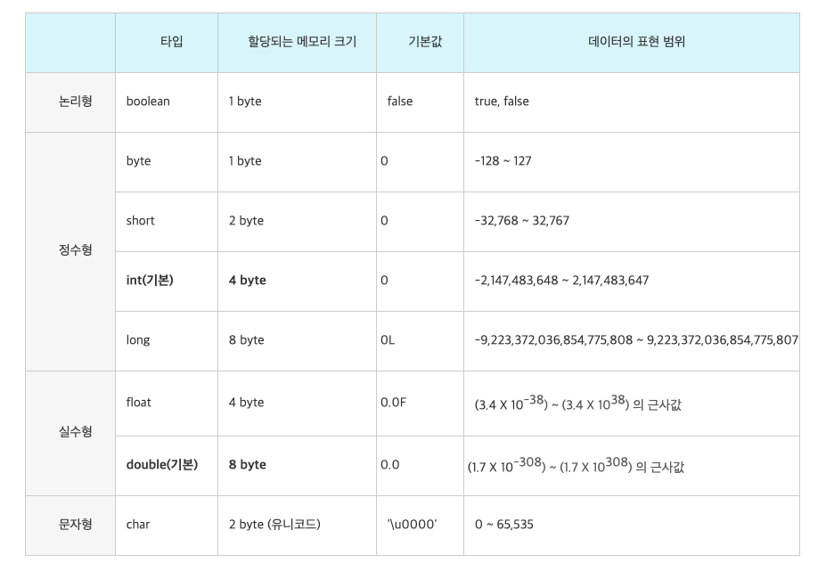

# 목표
## 자바 데이터 타입, 변수 그리고 배열
- 자바의 프리미티브 타입, 변수 그리고 배열을 사용하는 방법을 익힙니다.

## 학습할 것
- [프리미티브 타입 종류와 값의 범위 그리고 기본 값](#프리미티브-타입-종류와-값의-범위-그리고-기본-값)
- [프리미티브 타입과 레퍼런스 타입](#프리미티브-타입과-레퍼런스-타입)
- [리터럴](#리터럴)
- [변수 선언 및 초기화하는 방법](#변수-선언-및-초기화하는-방법)
- [변수의 스코프와 라이프타임](#변수의-스코프와-라이프타임)
- [타입 변환, 캐스팅 그리고 타입 프로모션](#타입-변환,-캐스팅-그리고-타입-프로모션)
- [1차 및 2차 배열 선언하기](#1차-및-2차-배열-선언하기)
- [타입 추론, var](#타입-추론,-var)

### 프리미티브 타입 종류와 값의 범위 그리고 기본 값
    자바의 타입에는 크게 나누어 두 종류의 타입이 있다. 
    
    기본형 타입(Primitive type)
        - 기본형은 논리형과 숫자형, 문자열형 등의 기본적인 데이터 타입이다.
        - "기본값이 있기 때문에 Null이 존재하지 않는다."
            - 만약 기본형 타입에 Null을 넣고 싶다면 래퍼 클래스를 활용한다.

- [이미지 출처](#https://gbsb.tistory.com/6)