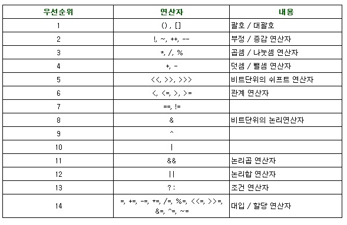

# 목표
## 연산자
- 자바가 제공하는 다양한 연산자를 학습하세요.

## 학습할 것
- [산술 연산자](#산술-연산자)
- [비트 연산자](#비트-연산자)
- [관계 연산자](#관계-연산자)
- [논리 연산자](#논리-연산자)
- [instanceof](#instanceof)
- [assignment(=) operator](#assignment(=)-operator)
- [화살표(->) 연산자](#화살표(->)-연산자)
- [3항 연산자](#3항-연산자)
- [연산자 우선 순위](#연산자-우선-순위)
- [Java 13. switch 연산자](#Java-13.-switch-연산자)


***계산이나 비교를 실시할 때에는 연산자를 이용하고 이러한 연사자는 연산 대상의 값이나 변수의 수에따라 이름이 분류되어 있다.***

### 산술 연산자
    산술 연산자는 수치 계산을 실시하기 위한 연산자다.

- [이미지 출처](http://blog.daum.net/hsjeong106/53)
    
    
        ++ 와 -- 는 기술하는 위치에 따라 약간 동작이 다르다. 
        연산자를 왼쪽에 작성하면(전치 연산) "먼저 계산을 한 후" 그 결과를 사용한다.
        반대로 연산자를 오른쪽에 작성하면(후치 연산) "현재의 값이 사용되고나서" 그후에 계산을 한다.
```java
int numberA = 1;
int numberB = 1;
System.out.println(++numberA); // 2
System.out.println(numberB++); // 1
System.out.println(numberB); // 2
```        
### 비트 연산자
    비트 연산자는 숫자값의 비트 연산을 실시할 수 있는 연산자다.

- [이미지 출처](https://velog.io/@foeverna/Java-%EC%97%B0%EC%82%B0%EC%9E%90-%EA%B4%80%EA%B3%84-%EB%85%BC%EB%A6%AC-%EC%A1%B0%EA%B1%B4-%EB%B9%84%ED%8A%B8-%EC%97%B0%EC%82%B0%EC%9E%90)    


### 관계 연산자
    관계 연산자는 2개의 인수를 비교하는 연산자다.

- [이미지 출처](https://programmer-seva.tistory.com/8)
```java
boolean result = 1 > 2;
System.out.println(result); // false
```

### 논리 연산자
    논리 연산자는 참과 거짓을 판정하는 논리 연산을 실시하기 위한 연산자다.

- [이미지 출처](https://velog.io/@foeverna/Java-%EC%97%B0%EC%82%B0%EC%9E%90-%EA%B4%80%EA%B3%84-%EB%85%BC%EB%A6%AC-%EC%A1%B0%EA%B1%B4-%EB%B9%84%ED%8A%B8-%EC%97%B0%EC%82%B0%EC%9E%90)
```java
boolean conditionA = true;
boolean conditionB = false;
System.out.println(conditionA || condtionB); // true  
```

### instanceof
    변수에 대입된 객체의 타입이 실제로 무엇인지를 판정하는 방법으로 instanceof 연산자를 사용할 수 있다.
    즉, instanceof 연산자는 좌변의 객체가 "우변에 지정한 클래스 또는 계승한 클래스인지"의 여부를 판정한다.
```java
public interface BaseService {
    public String say();
}

public abstract class AbstractBaseService implements BaseService {
    protected String name;
    public AbstractBaseService(String name) {
        this.name = name;
    }
}

public class FooService extends AbstractBaseService {
    public FooService(String name) {
        super(name);
    } 
    @Override
    public String say() {
        return "Hello";
    }
    
    public static void main(String[] args){
      FooService obj = new FooService("hong");
      System.out.println(obj instanceof FooService); // true
      System.out.println(obj instanceof AbstractBaseService); // true
      System.out.println(obj instanceof BaseService); // true
      System.out.println(obj instanceof Integer); // false
    }
}
```
### assignment(=) operator
    대입 연산자는 값을 대입하거나 대입과 함께 연산을 실시하기 위한 연산자다.

- [이미지 출처](https://unknownyun.blogspot.com/2018/08/blog-post_80.html)
```java
int num = 0;
num += 100;
System.out.println(num); // 100 
```
### 화살표(->) 연산자
    람다식은 메서드의 인수 등에 처리 그 자체를 건네는 것이 가능한 강력한 기법이다.
    자바 8에서는 구현해야 할 메서드가 하나밖에 없는 인터페이스를 "함수형 인터페이스"라는 이름으로 취급할 수 있다.
    람다식은 이 함수형 인터페이스 대신 사용할 수 있는 것이다.
    
    람다식은 (인수) -> { 처리 } 의 기본 문법으로 기술한다.
    예를들어 compare(Student s1, Student s2) 와 같은 메서드는 아래와 같이 대체할 수 있다.
```java
(Student s1, Studnet s2) -> {
    retun Integer.compare(s1.getScore(), s2.getScore());
}
```    
    이러한 람다식은 대입할 곳의 함수형 인터페이스로부터 구현해야할 메서드와 그곳에 정의되어 있는 인수의 타입을 알 수 있으므로
    1) 메서드의 인수 타입을 생략할 수 있고
    2) 인수가 하나밖에 없는 경우는 인수의 소괄호를 생략할 수 있고
    3) 인수가 없는 경우에는 소괄호만 쓰면 되고
    4) 람다식의 처리가 하나밖에 없는 경우 return과 중괄호를 생략할 수 있다.
    
    즉 아래와 같이 표현할 수 있다.
```java
(s1, s2) ->  Integer.compare(s1.getScore(), s2.getScore());
```   
    
### 3항 연산자
    2개의 식 중 어느 것을 이용할 것인지 판정하기 위한 연산자다.

- [이미지 출처](https://coding-factory.tistory.com/266)
```java
boolean result = 1 > 0 ? true : false;
System.out.println(result); // true 
```

### 연산자 우선 순위
    기본적으로 연산자에는 우선순위가 있으며, 괄호의 우선순위가 제일 높고, 산술 > 비교 > 논리 > 대입의 순서이며 단항 > 이항 > 삼항의 순서이다.
    연산 진행방향은 왼쪽에서 오른쪽으로 수행되며, 단항 연산자와 대입 연산자의 경우에는 오른쪽에서 왼쪽으로 수행된다.

- [이미지 출처](https://toma0912.tistory.com/66)

### Java 13. switch 연산자
    변수의 값(또는 식의 계산 결과)에 따라 처리를 나누는 제어 구문이다.
    변수의 값과 일치하는 case 값이(값1, 값2..) 있다면 해당 case문 하위의 문장이 실행된다.
    case문마다 break를 작성할 수 있는데 해당 case문을 실행한 뒤 switch문을 빠져나가기 위한 것이다.
    아무 값도 일치하지 않으면 default에 작성된 구문을 실행하고 default는 생략이 가능하다.
    
    만약 변수 == 값1이고 break가 없다면 값1부터 아래에서 break를 만날때까지 모든 구문이 실행된다.
    즉 아래 예에서는 변수 == 값1이라면 hi와 bye가 출력되는 것이다.
```java
switch (변수) {
    case 값1:
        System.out.println("hi");
    case 값2:
        System.out.println("bye");
        break;
    default:
        break;
} 
```
    switch에 사용하는 변수로는 다음과 같은 것을 이용할 수 있다.
    1) 숫자값
    2) enum 타입
    3) 문자열(자바 7이상)
    
    자바 14에서는 자바 12-13에서 preivew feature였던 기능이 도입되었다.
    1) case 안에서 여러개의 값을 받는 것이 가능해졌고,
    2) yield 로 값을 할당하는 것이 가능해졌다.
    3) -> 표현으로 break 없이도 해당 case에서 switch 에 대한 종료가 가능해졌다.
    4) {} 안에 구문을 작성할 수 있게 되었다.
```java
int days = switch (month) {
        case 1, 3, 5, 7, 8, 10, 12 -> 31;
        case 4, 6, 9 -> 30;
        case 2 -> {
            Scanner scanner = new Scanner(System.in);
            System.out.print("Enter year: ");
            int year = scanner.nextInt();
 
            if (year % 4 == 0)
                yield 29;
            else
                yield 28;
        }
        default : yield 0;
};
```